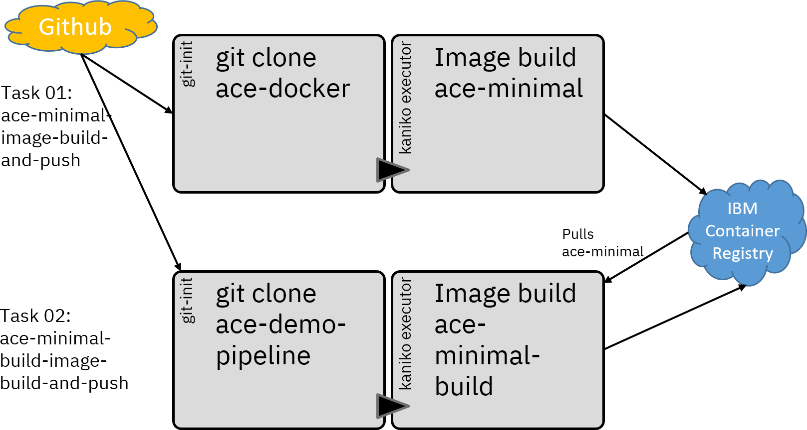

# Tekton builds of pre-req images

Used to build images that can then be used to build and run ACE applications.



## Getting started

 Most of the specific registry names need to be customised: us.icr.io may not be the right region, for example, and us.icr.io/ace-registry 
is unlikely to be writable. Creating registries and so on (though essential) is beyond the scope of this document, but customisation of
the artifacts in this repo (such as ace-minimal-build-image-pipeline.yaml) will almost certainly be necessary.

 The Tekton pipeline relies on docker credentials being provided for Kaniko to use when pushing the built image, and these credentials
must be associated with the service account for the pipeline. Create as follows, with appropriate changes for a fork of this repo:
```
kubectl create secret docker-registry regcred --docker-server=us.icr.io --docker-username=iamapikey --docker-password=<your-api-key>
kubectl apply -f https://raw.githubusercontent.com/ot4i/ace-demo-pipeline/master/tekton/service-account.yaml
```
The service account also has the ability to create services, deployments, etc, which are necessary for running the service.

Setting up the pipeline requires Tekton to be installed, tasks to be created, and the pipeline itself to be configured. The following
commands build the ace-minimal image and push it to the registry:
```
kubectl apply -f https://storage.googleapis.com/tekton-releases/pipeline/latest/release.yaml
kubectl apply -f https://raw.githubusercontent.com/ot4i/ace-demo-pipeline/master/tekton/01-ace-minimal-image-build-and-push-task.yaml
kubectl apply -f https://raw.githubusercontent.com/ot4i/ace-demo-pipeline/master/tekton/ace-minimal-image-pipeline.yaml
kubectl apply -f https://raw.githubusercontent.com/ot4i/ace-demo-pipeline/master/tekton/ace-minimal-image-pipeline-run.yaml
tkn pipelinerun logs ace-minimal-image-pipeline-run-1 -f
```

Once that has been built, the ace-minimal-build image can be built as follows:
```
kubectl apply -f https://raw.githubusercontent.com/ot4i/ace-demo-pipeline/master/tekton/02-ace-minimal-build-image-build-and-push-task.yaml
kubectl apply -f https://raw.githubusercontent.com/ot4i/ace-demo-pipeline/master/tekton/ace-minimal-build-image-pipeline.yaml
kubectl apply -f https://raw.githubusercontent.com/ot4i/ace-demo-pipeline/master/tekton/ace-minimal-build-image-pipeline-run.yaml
tkn pipelinerun logs ace-minimal-build-image-pipeline-run-1 -f
```

## Issues with Kube nodes and Tekton

In certain cases, the images present in the repository cannot be "seen" by the Tekton pipeline task steps, for
unclear but credential-related reasons. Starting pods that use the images appears to force the pull to the worker
node, and this can be done as follows:
```
kubectl delete pod force-pull
kubectl apply -f https://raw.githubusercontent.com/ot4i/ace-demo-pipeline/master/tekton/force-pull-of-images.yaml
```

## OpenShift CRC

The majority of steps are the same, but the registry authentication is a little different; assuming a session logged in as kubeadmin, it would look as follows:
```
kubectl create secret docker-registry regcred --docker-server=image-registry.openshift-image-registry.svc:5000 --docker-username=kubeadmin --docker-password=$(oc whoami -t)
```
Note that the actual password itself (as opposed to the hash provided by "oc whoami -t") does not work for registry authentication for some reason.

After that, the pipeline runs would be
```
kubectl apply -f https://raw.githubusercontent.com/ot4i/ace-demo-pipeline/master/tekton/os/ace-minimal-image-pipeline-run.yaml
kubectl apply -f https://raw.githubusercontent.com/ot4i/ace-demo-pipeline/master/tekton/os/ace-minimal-build-image-pipeline-run.yaml
```
to pick up the correct registry default.
