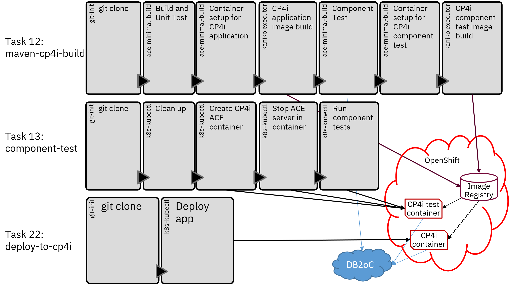

# CP4i pipeline

This pipeline is similar to the main project pipeline, but is designed to work with the Cloud Pak for Integration (CP4i) 
and uses the App Connect Enterprise certified containers for runtime. It also runs component tests in a CP4i container to
allow JDBC connections to be tested using the same CP4i configurations used by the deployed application itself.



## Container builds

The pipeline creates the main applicaiton image first, and then builds the component test image on top of the first image.
Kaniko is used to build both images in the pipeline, with Maven building the applications and libraries.


## Component testing

The component testing itself relies on the operator support code (runaceserver) to create the correct policies and
credentials from the configurations provided. This allows the component tests to run with the same setup as the application
itself, ensuring the tests are providing useful results.


The test run strategy is as follows:

- Create a CR with MQSI_PREVENT_CONTAINER_SHUTDOWN set plus the database credentials configurations (and any other needed configurations) using the second custom image (the one with the tests), and let it start up.
- Stop the running server with kill -INT 1 (via kubectl exec) to cause the runaceserver code to shut the server down and then wait (due to MQSI_PREVENT_CONTAINER_SHUTDOWN  being set).
- Once the server is stopped, run a new server (using kubectl exec or whatever) that specifies the correct test project and any test options (like IntegrationServer -w /home/aceuser/ace-server --test-project SomeTestProject --start-msgflows false)
- Collect the output and return code from kubectl exec as usual, allowing the pipeline to stop on failed tests.
- Delete the CR, and then send another kill -INT 1 to make the runaceserver code exit.

See [13-component-test-in-cp4i-task.yaml](13-component-test-in-cp4i-task.yaml) for details on running the tests.

Note that this splits responsibilities between the ACE operator (create the work directory and run the initial server) and the
ACE product itself (run the tests and report the results); the operator support code in the container does not know anything
about running tests.

## Pipeline setup and run

Many of the steps are the same as the main repo, but use the `cp4i` namespace. Security constraints are more of an issue
in OpenShift, and Kaniko seems to require quite a lot of extra permissions when not running in the default namespace.

Configurations need to be created for the JDBC credentials (teajdbc-policy and teajdbc) and default policy project name
in a server.conf.yaml configuration (default-policy).

The initial commands are 
```
kubectl create secret -n cp4i docker-registry regcred --docker-server=image-registry.openshift-image-registry.svc.cluster.local:5000 --docker-username=kubeadmin --docker-password==$(oc whoami -t)
kubectl apply -f tekton/os/cp4i/cp4i-scc.yaml
kubectl apply -f tekton/os/cp4i/service-account-cp4i.yaml
oc adm policy add-scc-to-user cp4i-scc -n cp4i -z cp4i-tekton-service-account
kubectl apply -f tekton/os/cp4i/12-maven-cp4i-build-task.yaml
kubectl apply -f tekton/os/cp4i/13-component-test-in-cp4i-task.yaml
kubectl apply -f tekton/os/cp4i/22-deploy-to-cp4i-task.yaml
kubectl apply -f tekton/os/cp4i/cp4i-pipeline.yaml
```
and to run the pipeline
```
kubectl apply -f tekton/os/cp4i/cp4i-pipeline-run.yaml
tkn pipelinerun -n cp4i logs cp4i-pipeline-run-1 -f
```
